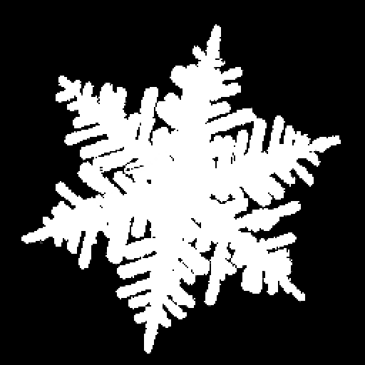

### Out of Sight Snow

This mod aims to add snow fall and ice generation to unloaded chunks efficiently. It accomplishes this with the following process:

1. Every tick, iterate over cached chunks and check the TickOfLastRandomTick. 
3. Get the difference. If the difference is one or less, stop.
2. Otherwise, we know that ice or snow could have been generated. Simulate ice and snow fall.

Further work in the future may be done to make this process m

The simulation has the following process:
1. We generate a random number from a binomial distribution of "ices/snows tried". We use Colt's implementation of a binomial random variable generator. Minecraft has a 1/16 chance of trying to ice some water/place snow every tick.
2. We turn that number of ices/snows into an array representing the number of times that block was chosen for snow/ice. This is done with a clever method I found off stack overflow. More info [here](https://stackoverflow.com/questions/18600348/how-do-i-generate-random-numbers-in-an-array-that-add-up-to-a-defined-total/18600737)
3. We generate an array of integers from 0 to 255 representing our "interpretation" of the array. For instance, if an ice block tries generating in the middle of a pond, it can't. But if a block of ice generated on the wall beforehand, it can be placed. Randomly generating the "interpretation" helps let ice feel more random and closer to vanilla generation.
4. We use the interpretation to place the ice and snow. This is the most straightforward part. 

What I neglected to mention was that we actually generate separate arrays for ice+snow and just ice. This is because ice can always form, but snow can only form during the ticks that it rains.

The comments in the code also offer some insight.